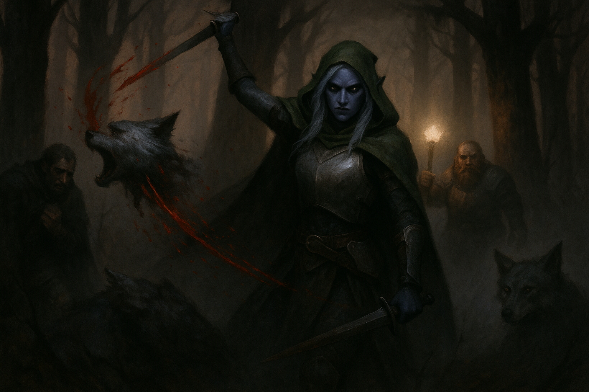

# Twelve Missing

*2026-07-05*

## Overview

Three strangers — a scarred human mercenary, a drow who has outlived most of the
town, and a dwarf who is the last living thing to walk out of his monastery —
reach for the same job posting outside the [Silverbrier
Estate](../wiki/locations/silverbrier-estate.md) at the same moment. Twelve
loggers, gone two weeks into the [Graylight
Forest](../wiki/locations/graylight-forest.md). Twenty gold a head, and only if
they get there before the *other* rescue party does. They spend a day shaking
what little truth [Timberfall](../wiki/locations/timberfall.md) has out of it,
walk into the fog at first light, and discover on the first evening that the
wolves in the Graylight do not behave like wolves.

## Key Events

- **The posting.** Twelve loggers — orcs, humans, a gnome or two — sent two or
  three days deep by the [Silverbrier family](../wiki/factions/silverbrier-family.md)
  and unheard from since. In a town of fifty or sixty people, that is a fifth of
  the population, and nothing like it has ever happened before.
- **Icarus was supposed to be there.** He had been hired as the logging camp's
  security escort and arrived two weeks late from Deep Hollow. The camp went out
  without him. The [head of security](../wiki/npcs/silverbrier-head-of-security.md)
  — a smug, salt-and-pepper man who stands at the gate and never goes past it —
  seemed to consider this Icarus's problem rather than the family's.
- **A bad deal, badly negotiated.** Twenty gold per surviving logger, split
  three ways. Icarus tried to talk it up to thirty and failed. The head of
  security's counteroffer was that he could go out alone and keep the others'
  shares if they died — and that if they killed each other out there, nobody at
  the estate would care.
- **They are in a race and nobody told them.** A previous rescue party of four
  went out roughly a week ago. Whichever group brings back living loggers *first*
  gets paid. The other gets nothing.
- **The map.** A hand-drawn thing with random trees scattered across it and a
  single X, which the head of security cheerfully admitted he had only recently
  learned to draw.
- **The Fat Goat.** At the [tavern](../wiki/locations/the-fat-goat.md) they found
  [Jonas Dawn](../wiki/npcs/jonas-dawn.md), the town healer, alone at a table with
  an untouched ale and a leg jittering hard enough to hear across the room. His
  sister [Miriam](../wiki/npcs/miriam-dawn.md) is in the first rescue party. She
  negotiated thirty-five gold a survivor and intends to hand every coin of it to
  their meager temple. She has been gone a week.
- **Icarus assaulted the healer.** Frustrated at getting nothing useful, he
  grabbed Jonas by the shirt and threatened to kill him. Wilonet slid in behind
  with a dagger drawn, then talked him down and smoothed it over. Jonas gave up
  healing potions from the church anyway — one to Icarus, one pocketed, and a
  third to Wilonet with the instruction: *don't use it on him.*
- **"The dawn gives me power."** Jonas said it to the man who had just threatened
  his life, and did not seem to be speaking figuratively. Grano identified the
  [Church of the Dawn](../wiki/factions/church-of-the-dawn.md) from the pendant and
  the potions — redemption, rebirth, beginning again.
- **Something is riding Icarus.** Jonas's parting blessing, *"may the light find
  you,"* was answered from inside Icarus's own skull by a voice that was not his:
  **"Good. We don't want the light."**
- **Ol' Marnie's.** [Old Marnie](../wiki/npcs/old-marnie.md), an elf ancient even
  by elven standards and an old friend of Wilonet's, gave them the only real
  intelligence they got all day: the forest plays tricks on the mind, the forest
  does not want to be cut down, the spirits in it have lain dormant a long time,
  and the deeper you push the angrier they get. His hard advice: **don't trust
  everything you see out there.** He had no potions left to sell — he'd given his
  stock to Jonas. He asked them to bring back **nightroot** if they saw it, and
  sketched the dark blue vine for them.
- **Icarus went shopping without paying.** While Wilonet talked, he cased the
  shelves and marked a bottle that looked empty until the light caught it — a
  clear liquid that *moved* on its own. He could not identify it. He has announced,
  out loud, that he intends to come back and steal it.
- **Into the Graylight.** They camped at the treeline and went in at first light.
  Grano found the loggers' route: an easy path, and cart tracks in the mud.
  Wilonet spotted one of her own old hunter's traps a step ahead of Icarus's boot,
  stopped him, and then set it off with a thrown rock to show him what he'd nearly
  walked into. He thanked her. She hated him slightly less. He did not
  reciprocate.
- **The wolves.** Howling at dusk, fog thickening. Everyone agreed they were
  ordinary wolves. They were not. These **blink** — vanishing mid-lunge and
  reappearing behind you, thirty feet away, out of nothing. Nobody in Timberfall
  has ever seen a wolf do that.
- **The fight.** One savaged Icarus for seven damage — he had eleven hit points,
  an armor class of eleven, and had forgotten he owned a defensive spell. At four
  hit points he disengaged and hid behind a tree. Grano took jaws on his chainmail,
  burned the beast with sacred flame, and cracked it with his mace. Wilonet killed
  two: one beheaded so cleanly the body blinked out of existence before it dropped,
  and one opened from throat to belly while she held eye contact with the last wolf
  standing. It tried to teleport away. It couldn't.

## Memorable Moments

- **Forty gold.** Wilonet, rolling a natural 20 on perception from across the
  tavern, heard Icarus mocking his own party to Jonas — and answered by announcing
  to the entire room that the price to rescue Jonas's sister had just gone up to
  forty gold.
- **Eldritch blast, described.** Asked what his magic looked like in that
  oppressive fog, Icarus said he reaches down, scoops a handful of the gray out of
  the air, and throws it. It does not glow. It vanishes into the murk.
- **Grano's sacred flame.** "Bright, vibrant, cleansing, and plain." It left the
  wolf's gray fur charred.
- **The rock and the trap.** Wilonet openly admitted she considered letting Icarus
  step into the snare. She saved him instead — and then triggered it in front of
  his face, just to make the point.
- **"At this point, it's personal."** She disemboweled the second wolf from the
  neck down while staring at the third one. The DM made her roll intimidation. She
  did not need the advantage.
- **The DM's public service announcement.** Delivered mid-shakedown, to a table of
  first-timers: D&D is not a video game. Murder someone in cold blood and the
  character you spent ninety minutes building is dead forever.

## Open Threads

- **Twelve loggers**, two or three days deep, missing two weeks. Alive is worth
  twenty gold each. Dead is worth nothing.
- **Miriam Dawn and her three companions** — an orc hedge knight, a smug high elf
  who claims family, and a flashy gnome with black or blue hair — a week gone, and
  the party's direct competition for the fee.
- **What is in Icarus?** Something in him recoiled from a blessing and spoke in
  the first person plural.
- **The blinking wolves.** Nothing in local memory does this. Nobody knows what
  changed, or how deep it goes.
- **Nightroot**, and whatever Old Marnie means to make of it.
- **The bottle on Marnie's shelf** — clear, alive, unidentified, and already
  earmarked for theft.
- The forest, [Marnie says](../wiki/npcs/old-marnie.md), does not want to be cut
  down. The party is now three days from anyone who could help them.

## The Scene

The howling had been ordinary. That was the thing they would come back to
afterward, each of them privately: they had all three stopped, and listened, and
agreed. Wolves. The Graylight has wolves the way any forest has wolves. You keep
a fire and you keep a watch and in the morning you keep walking. Then the first
one came out of the ferns at Icarus, and he saw it leave the ground — jaws wide,
the wet black of the mouth, all that weight arriving — and he threw his arm up to
brace against it, and nothing came. The air closed over the place where the wolf
had been, smoothly, like water over a dropped stone. He stood there with his arm
raised against an empty forest. He had half a second to be confused, and he spent
it.

Then he heard it breathing behind his ear. It took him on the arm — the right
one, the one he scoops the gray out of the air with, the one the magic comes out
of — and it bit down and *worried* it, and the sound Icarus made was not a word.
Seven points of the eleven he had. He went down into the wet leaves with his blood
running out of him in a rope, and he did not get up; he dragged himself backward
until there was a tree between him and the thing, and he stayed there. Behind him
Grano's mace kindled with a clean white light that did not belong in this place,
and the wolf that had opened the man's arm turned, unhurried, to see what else was
on offer.

Wilonet was already walking. Not running — walking, short sword low at her side,
the way you approach something you have already finished deciding about. Three
hundred years in forests, and half of them in this one, and she had never once
been afraid of a wolf. The animal blinked toward her and she was not where it
arrived. Her blade came up under its jaw and through, one long clean stroke, and
the head went one way and the body went the other and then the body simply *stopped
being there* — blinked out mid-fall, gone, and reappeared thirty feet off in the
fog to drop into the ferns like a sack of meat. She did not watch it land. She had
already turned to the last one, and she opened it from the throat down while she
held its eyes, and she made certain it understood. It gathered itself to blink
away. Nothing happened. Behind her, from behind his tree, Icarus decided he had
been right about her all along and revised nothing else.
