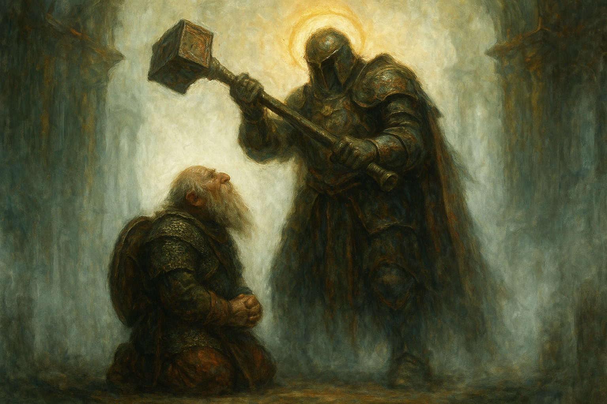

# I Think We're Still Here

*2026-07-19*

## Overview

Four days deeper into the [Graylight](../wiki/locations/graylight-forest.md), and the forest
stops attacking the party's bodies and starts on their heads — three dreams of a monastery
dying, a flashback to a murder on the road, and a snake that had learned to look like the plant
they were sent to fetch. They reach the [logging camp](../wiki/locations/the-logging-camp.md)
at last and find no bodies, no blood, and a foreman's journal that explains exactly how twelve
men stopped being people. Then they sleep in that camp, and all three of them watch it work
through the night without anybody in it.

## Key Events

- **Grano put Icarus back together.** The session opened on the aftermath of the wolves:
  **cure wounds**, eight points, an arm that had been *loose meat with the tendons showing*
  made into an arm again. Icarus's entire response was *"Grano. Thank you, Grano."* They have
  still barely spoken otherwise.
- **Butchery, badly.** Icarus rolled a 4 to harvest the blink dogs and made such a mess of the
  carcass that the meat was ruined; the DM had [Grano](../wiki/pcs/grano.md) physically move him
  out of the way and do it properly on a 22. Two vials of blink dog blood — something a potion
  could be made from later.
- **Three dreams, one night.** On first watch Grano fell into a heavy sleep and dreamed his
  monastery three separate times. An abbot greeting him warmly whose face melted into red skin
  and horns while his brothers were slaughtered around him. A haloed figure in white light who
  asked *"is your faith pure?"*, swung a mace down on him, stopped it an inch short, and said
  **"maybe you will survive, brother Grano. My mace deems that you are worthy."** And the temple
  floor bursting open with roots, pillars crushing his brothers, the survivors turning silently
  to leaves and pine needles. In all three, he was the only one left alive. He does not know
  which were dreams and which were memory.
- **Something ate the wolves.** They returned to the corpses in the morning to find them chewed
  on. [Wilonet](../wiki/pcs/wilonet.md) read the marks on a 17: not sharp, not canine. **Human,
  or humanoid.** Icarus's contribution was to walk over to the one that had bitten him and kick
  it, and get a leg full of viscera for it.
- **Icarus's flashback.** The haze thickened and took him off the trail entirely, back onto the
  road to Timberfall: days late, sleeping rough, and [the voice](../wiki/npcs/the-voice.md)
  telling him *I need sustenance. You will give me what I need, Icarus. We are bound together.*
  Then a farmhouse, and [a kindly old man](../wiki/npcs/the-old-farmer.md) who fed him, gave him
  a bed, and waved away his gold. At two in the morning the voice woke him and sent him down to
  the cellar, where the old man's arms were suddenly huge and he was chopping up a human body.
  *Kill him. Slice his throat and sustain me.* Icarus kicked him down the stairs, drew his
  sword — and his other hand came up on its own and his magic fired **for the first time in his
  life** and took the farmer's face off.
- **And then the correction.** The blood ran up the blade and into it. The arms on the corpse
  were an old man's arms again, thin, no muscle. And the body on the chopping block was
  **venison** — a deer. Icarus had murdered a man for feeding him. The voice, satisfied: *"We
  will keep doing this, Icarus, but you will keep getting stronger. And if you don't, **your
  mother's life is forfeit.**"*
- **He told them nothing.** He came out of it shaking in front of the other two. Wilonet — who
  has had no visions at all — warned him there is a magic in this forest and not to let it get
  into him: *"Focus on the present, or there won't be a future."* He said he was fine. He said
  he was just thinking of the past.
- **The Nightroot Asp.** [Old Marnie](../wiki/npcs/old-marnie.md)'s nightroot, a beautiful
  cluster of it, right there on a trunk. Wilonet did everything correctly — remembered the
  warning, stopped, rolled to check whether it was real — and the forest lied to her well
  enough anyway. The vine **tensed** under her hand, turned visible, and bit her for five and a
  poison she barely made the save against, then vanished into the trees.
- **The fight.** Icarus opened with **armor of Agathys** before he even knew what he was
  fighting, describing the frost over him like breath fogging a window. Grano burned the thing
  with sacred flame for eight and hit it with **inflict wounds** for twelve, watching its
  vibrant blue dull down to the color of the forest. Wilonet — bitten, rattled — drank a potion,
  moved in beside Grano, rolled a **natural 1** that put a sword scar across the dwarf's armor
  instead of the snake, then threw a rock that bounced off its skull and hit Icarus in the eye.
  She announced she would stand back and let them handle it.
- **Grano went down.** The asp came back around on him and rolled a **natural 20**. Under the
  DM's brutal-critical rule that is maximum damage plus a die: thirteen, against ten hit points.
  Seven or eight feet of snake left the ground and took him in the throat, deep, and put him on
  his back with his blood on a tree.
- **Icarus killed it.** He tried to back out of melee first, learned what an attack of
  opportunity is, and stayed put. Then **witch bolt** — red, with little sparks of yellow light
  pushing through the color — and the thing slumped. Grano failed his first death save on a 3.
  Wilonet used her entire action to pour a health potion down his throat and brought him back at
  ten. Grano's first act on regaining consciousness was to cast **mending** on his armor.
- **The real nightroot was three feet away.** Lying in the open the whole time, tangled around
  the thing that had been imitating it. Wilonet refused outright to touch it — *"No. You're not
  getting me again. Get away from me, Satan"* — and Grano cut it. They harvested the asp too, on
  a 24: **four vials of poison**, and scales that might make armor carrying some of its
  invisibility.
- **The logging camp.** They reached it sooner than expected. Tents still standing, axes lying
  where they were dropped, nothing looted, nothing broken, **no bodies and no blood.**
- **[Halvik Dern](../wiki/npcs/halvik-dern.md)'s journal.** Grano found it on a 16, open on a
  desk. Twelve men, good time out from Timberfall, a fog in the mornings *like it refuses to
  move out of the way.* Then productivity collapsing for no reason anyone could name. Then men
  refusing to cut, saying **the wood feels wrong** and **the trees watch us back.** Then
  [Cara](../wiki/npcs/cara.md), the orcish woman off the trade roads, stopping mid-swing,
  putting her forehead against a tree, and beating her head into it until she bled before
  walking off into the forest with two men following her. And then the last entry, alone:
  *"I don't understand why I'm here. I'm the only one left. Where have all the others gone?
  I hope people can find us if we go missing. I think we're still alive. I think we're still
  here."*
- **The rescue party's tracks.** Icarus rolled a **23** and found what the loggers' boots
  couldn't explain: armored footprints, days old rather than a week and a half, coming into the
  camp — and then **splitting into two paths** going different directions. One set smaller than
  the other. [Miriam Dawn](../wiki/npcs/miriam-dawn.md)'s group got here first, and did not
  leave together.
- **They chose the smaller trail.** Icarus reasoned he knew and trusted Jonas over *some random
  knight*, and that Miriam had gone in looking for the loggers anyway, so finding her finds
  everyone. Wilonet agreed and made the call. They looted fifty feet of rope apiece and camped
  in the dead camp.
- **The night watch.** Wilonet, first: a figure walked in, picked up an axe, and chopped —
  making **no sound at all** where the blade met the wood — then set it down, stood there, and
  faded. Icarus, second: an orc woman coming into camp, shrugging off something that was not
  there, **translucent**, who put her forehead to a tree and began driving her head into it
  while the bark splintered and came away. Grano, third: people scattering out of the camp in
  every direction, gone when he looked at them.
- **In the morning, the tree was still broken.** Icarus went and looked at it without saying
  why. Chunks were missing from the trunk. Nobody could tell how fresh it was. The axe was
  exactly where it had been left.
- **They finally compared notes.** Wilonet asked whether anyone wanted to talk about their
  dreams, and admitted she had had none. Grano gave them: *"I don't know what it is. Be it
  memory, dream, or future of my past. Something."* Icarus gave them: *"I saw my past. The
  moment I don't speak of. Never."* Then they walked out after the smaller footprints.

## Memorable Moments

- **"My mace deems that you are worthy."** A haloed figure in a white void bringing an enormous
  mace down on a sleeping cleric and stopping it an inch short — the closest thing to a blessing
  Grano has ever been shown, delivered as a threat.
- **The deer.** Not the murder. The moment *after* the murder, when the monster's arms went back
  to being an old man's arms and the corpse on the block turned out to be a deer, and the thing
  in Icarus's head told him it had enjoyed that and would like more.
- **Wilonet's worst round in the campaign.** Last session she beheaded a wolf in one stroke.
  This session she got bitten by a plant, missed a snake at point-blank with a natural 1,
  scratched her own party's cleric, threw a rock that hit her least favorite person in the eye,
  and then said out loud: *"You idiot. I'm gonna just stay over here and let y'all handle this
  one."*
- **The apology.** After Grano came back up, she made a point of it, and it was not to the
  party — it was to him. *"I'm sorry it startled me, and I missed both of my shots. Glad you're
  okay."*
- **"I'm gonna let that slide."** Icarus, one minute after Grano's resurrection, cracking a joke
  about how old the dwarf is. It was Wilonet — who despises Icarus — who chose not to make
  anything of it.
- **The silent axe.** A figure chopping wood in a dead camp and making no sound whatsoever, then
  putting the axe down neatly, and the axe being right where it was left come morning.
- **The map.** Wilonet has quietly started **fixing** the Silverbriers' crude map as they go,
  marking in the wolf attack, the snake, the camp. It is now the only accurate chart of the deep
  Graylight that anyone has ever made.
- **"I think we're still here."** A foreman's last written sentence, and then three separate
  watchmen spending the night watching him be right.

## Open Threads

- **Which set of footprints was the wrong one?** They picked the smaller trail. The other one
  staggered off in a different direction and is still out there.
- **[Cara](../wiki/npcs/cara.md) and the two who followed her.** She walked into the Graylight
  bleeding from the forehead, under her own power. Two men went after her. None of the three has
  been accounted for.
- **What is left of Halvik Dern**, who went looking for his own crew after writing that he
  hoped somebody would find them.
- **The thing that chews on corpses** with humanoid teeth.
- **Icarus's mother** — named as collateral by something that lives in his head, and never
  mentioned by him before or since.
- **What the voice actually is.** It feeds on deaths, it pays in power, it fabricated a monster
  to get its first meal, and it hates the [Church of the Dawn](../wiki/factions/church-of-the-dawn.md).
- **Which of Grano's three dreams was real** — and whether a haloed figure with a mace is his
  god, someone else's, or the forest wearing a face.
- **Why Wilonet is immune.** Three hundred years at the edge of this forest, four days deep in
  it, and the Veil has shown her nothing at all while it takes the other two apart.
- **The nightroot and the venom** are in the party's packs and
  [Old Marnie](../wiki/npcs/old-marnie.md) is four or five days behind them.
- **Twelve loggers**, still. Nobody has found a single one of them, alive or dead.

## The Scene

He had already died once tonight. The abbot's face had come off like wax down a candle and
underneath it was red skin and horn, and the sound of his brothers dying had gone on and on in
the dark beyond the cloister, all of them shouting the holy words at a thing that did not care
about holy words, and when Grano opened his eyes in the dream there had been nothing standing
in that courtyard but himself and a ring of bodies. Then he had woken up in a forest that
smelled of wet leaf-rot and cold ash, with the drow sitting awake at the edge of the firelight,
her back to him, watching the fog. He had looked at her a while. Then he had closed his eyes,
because he was ninety-five years old and very tired, and a man has to sleep.

The white came in without a sound. Not a room — there was no floor under his knees and no
ceiling above him and no wall anywhere he could find, only light, everywhere, the way water is
everywhere when you are under it. Somewhere at the far edge of seeing there were pillars, or
the memory of pillars, going soft and coming apart the way things do when you look directly at
them. And then the figure walked out of the brightness toward him with a golden halo standing
off its head, and he could not make out its face, and he did not try. *We are faithful, are we
not?* Grano heard his own voice answer before he had decided to speak. **We are.** *Good.
Good.* The figure came closer, and closer than that. *Is your faith pure?*

**Yes,** he said. And the mace came up.

It was enormous. It came off the shoulder and down through the white with the whole weight of
that armored body behind it, a killing blow, the kind you do not survive and are not meant to,
and Grano did not move — not because he was brave, he thought afterward, but because there was
nowhere in that light to move to. He watched it come. He felt the air go out ahead of it. And
a hand's breadth above his skull it **stopped**, dead, the arms above him shaking with the
labor of having arrested it, the halo burning steady and indifferent behind. Nothing touched
him at all.

*Maybe you will survive, brother Grano,* the figure said. *My mace deems that you are worthy.*

He surfaced out of it into cold and pine and the crackle of a low fire. Icarus had the watch
now, sitting hunched with his ruined arm across his knee, staring at nothing. Grano lay still
and looked up through the black branches at a sky the Graylight never lets you see, and turned
the thing over, and could not make it come out right. It had not felt like a dream. Neither had
the demon. In an hour he would sleep again and the monastery floor would burst open with roots
and the pillars would come down and his brothers would blow apart into green leaves and pine
needles without making a sound, and he would be the only one left alive for the third time in
one night. He did not know that yet. He only knew that something enormous had decided not to
kill him, and had wanted him to be awake for the decision.
